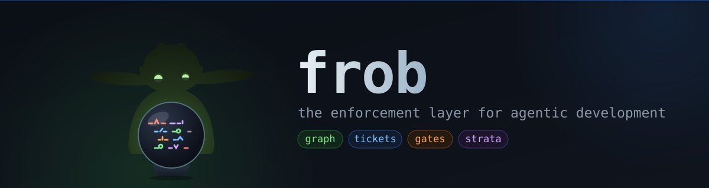

<p align="center">
  
</p>

# frob

The enforcement layer for agentic development. frob makes it impossible for
work to silently not happen: an obligation graph tracks every symbol's
identity, a statically-checkable ticket queue tracks every unit of work, and
a set of gates turn unaccounted-for change -- or unaccounted-for absence of
change -- into a `frob check` failure.

Division of labor: your editor or Serena navigates and edits code, frob
accounts for it. frob owns durable cross-artifact claims (docs, tickets,
invariants, policy) and their enforcement.

Install: `uv tool install frob`. This gets you the full CLI plus every gate
except two native-accelerated features -- smart-dup's R3+ rungs (frob-core)
and `.strata` design-file parsing (strata-core) -- both degrade honestly
(clear `Err`, no crash; see T-0133) rather than being required. For those,
build the native extensions from source and reinstall them into the same
tool environment: `make install-tool` (needs a Rust toolchain). See
docs/guides/install.md for the full picture, including why the natives
aren't a plain `pip install "frob[...]"` extra yet. For editable dev
install: `pip install -e .`, then `make core`.

---

## The enforcement loop

```
annotate -> check -> fix-or-waive
```

1. **Annotate.** As you write code, bind it to a ticket and its tests with
   comment directives: `frob:ticket T-0042`, `frob:tests <symref>`,
   `frob:doc docs/x.md#anchor`, `frob:invariant INV-007`.
2. **Check.** `frob check` builds the obligation graph, joins it against the
   ticket queue, docs, and policy, and fails on anything undeclared: a
   changed symbol with no ticket, a public function with no test, a doc that
   drifted out of sync, a diff that strayed outside its ticket's scope.
3. **Fix or waive.** Either close the gap (write the test, update the doc,
   file the ticket) or waive it explicitly with a reason:
   `frob:waive RULE-ID reason="..."`. A waiver is visible debt, never
   silence -- it shows up in every report.

Every violation message embeds its own remedy command, so an agent acting on
`frob check` output never hits a dead end.

---

## Commands

36 total commands, statically bound to the live subcommand registry
(DOC005, docs/modules/gates.md#doc005-readme-command-table-drift-lock-t-0435)
-- a subcommand added or removed here with no matching edit below fails
`frob check`.

### Enforcement

| Command | Description |
|---------|-------------|
| `frob graph` | Obligation graph: build the cache, query a symbol's edges, or explain drift (`why`) |
| `frob ack` | Acknowledge current digests for one or more symbol refs, updating `frob.lock` |
| `frob ticket` | The statically-checkable ticket queue: new/list/show/doable/start/attach/block/close/fail |
| `frob check` | Aggregate quality gate: ruff, ty, cycle/dup/arch/bind/exports, and the enforcement gates |
| `frob test` | Select and run tests for the touched set vs a base ref (or `--all`) |
| `frob vet` | Dependency capability vetting: source-resolved capability scan, CVE fingerprints, supply-chain/obfuscation checks |
| `frob sys` | strata system-design audit: model-vs-code conformance, threat/CWE/compliance/PII, deploy proofs (`plan`/`doc`/`audit`/`export`) |
| `frob deploy` | Auditable OS-layer deployment: compile a host manifest into idempotent install/status/uninstall + VM audit |
| `frob release` | Mechanical semver from the public-API graph and the REL001 release gate (`stamp`/`check`) |
| `frob registry` | Unified design-knowledge registry: the REG001-010 exhaustiveness drift-lock over `docs/design/registry/*.yaml` (`audit`/`add`) |
| `frob pool` | Ratchet-pool baseline management: freeze warn-rule findings as a tracked baseline so new findings error (`snapshot`/`clear`) |
| `frob debt` | List outstanding `frob:debt` entries (rule, site, ticket, until) |
| `frob deprecated` | List outstanding `frob:deprecated` entries (symref, since, sunset, ticket, status) |
| `frob fleet` | Cross-repo status/gate rollup and ticket routing over a `fleet.toml` manifest of sibling repos (`status`/`route`) |

### Analysis

| Command | Description |
|---------|-------------|
| `frob map` | Recursive directory tree with file sizes and line counts |
| `frob outline` | Structural skeleton of a file: classes, functions, signatures, line numbers |
| `frob xref` | Find where a symbol is defined and every file that references it |
| `frob cycle` | Detect import cycles in Python packages |
| `frob dup` | Detect duplicate/clone code segments |
| `frob arch` | Arch analysis: long functions, god classes, coupling |
| `frob docs` | Extract docstrings or search `docs/` for a file/symbol |
| `frob exports` | Generate a ready-to-paste `__init__.py` from all public symbols |
| `frob bind` | Verify binding declarations match source signatures |
| `frob parse` | Parse tool output (pytest/ruff/ty/clang/junit) into a compact summary |
| `frob gitlog` | Summarize git history filtered by conventional commit type |
| `frob perf` | Profiling (`profile`/`heat`) and the PERF001-004 linear-scan gates |
| `frob mutate` | Mutation testing: the honest test-quality oracle |
| `frob stats` | DORA-ish delivery measurement (queue health + commit cadence); measurement only |
| `frob serve` | MCP stdio adapter exposing doable tickets, stale docs, scope/graph queries as read-only tools |

### Setup

| Command | Description |
|---------|-------------|
| `frob scaffold` | Scaffold a new project from a registered template |
| `frob doctor` | Verify native extensions (`frob_core`, `strata_core`) are installed |
| `frob natives` | Build declared `[[native]]` crates via `maturin develop`, sharing one git-common-dir-keyed `CARGO_TARGET_DIR` (`build`) |
| `frob clean` | Remove build/test/cache artifacts (tiered, dry-run by default) |
| `frob fmt` | Canonicalize `frob:` directive comment line-wrapping: fewest physical lines within the line-length limit (`--check` previews without writing) |
| `frob agent` | Print/export the dispatched-agent guard env (`FROB_WORKTREE`/`FROB_AGENT`) for a worktree (`env`) |
| `frob worktree` | Manage dispatched-agent git worktrees: lease-aware stale-worktree cleanup (`sweep`) |

`frob scaffold apply`'s `git stash` guard needs git >= 2.28 (the
`reference-transaction` hook it installs); the hook file is still
written on an older git, but git itself never invokes that hook name
below 2.28, so the guard is silently inert there -- fail-open, not an
install error.

---

## Quickstart

```bash
frob graph build                                  # build the obligation graph cache
frob ticket new --title "Add multiply function" \
    --kind feature --scope "src/demo/calc.py"     # T-0001
frob ticket start T-0001                          # pre-work sweep, -> in-progress

# write code, bind it: `# frob:ticket T-0001` above the new symbol,
# `# frob:tests <symref>` above the test that covers it

frob check . --ticket T-0001                      # fails: undeclared change
# ... add the directives, write the test ...
frob check . --ticket T-0001                      # coverage/scope/drift clean

frob test --base main                             # run exactly the touched-set tests
frob ack src/demo/calc.py::multiply --facet sig    # acknowledge a described contract
frob ticket close T-0001                           # requires evidence + a Done report
```

See `docs/guides/quickstart.md` for the full walkthrough with real command output, and
`docs/` for per-command references and module design docs.

---

## Release status

`frob` is at `0.2.0` -- no tagged release has been published yet, but the
tree is provably releasable: `frob release check` is green against the
tracked `.frob-release.json` manifest, `uv build --wheel` produces a
working wheel, and the natives-less degrade contract (T-0133/T-0134/T-0135)
plus dependency completeness (T-0142/T-0152) are verified from that built
wheel in a bare venv, not just from source. See `CHANGELOG.md` for the full
list of what shipped, grouped by area, and `docs/modules/release.md` for
the REL001 gate mechanics.
